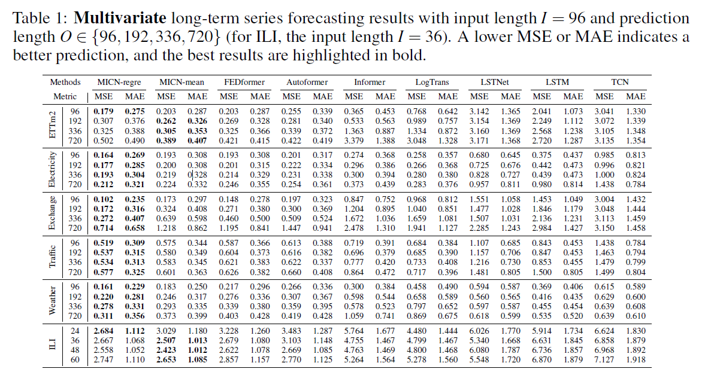
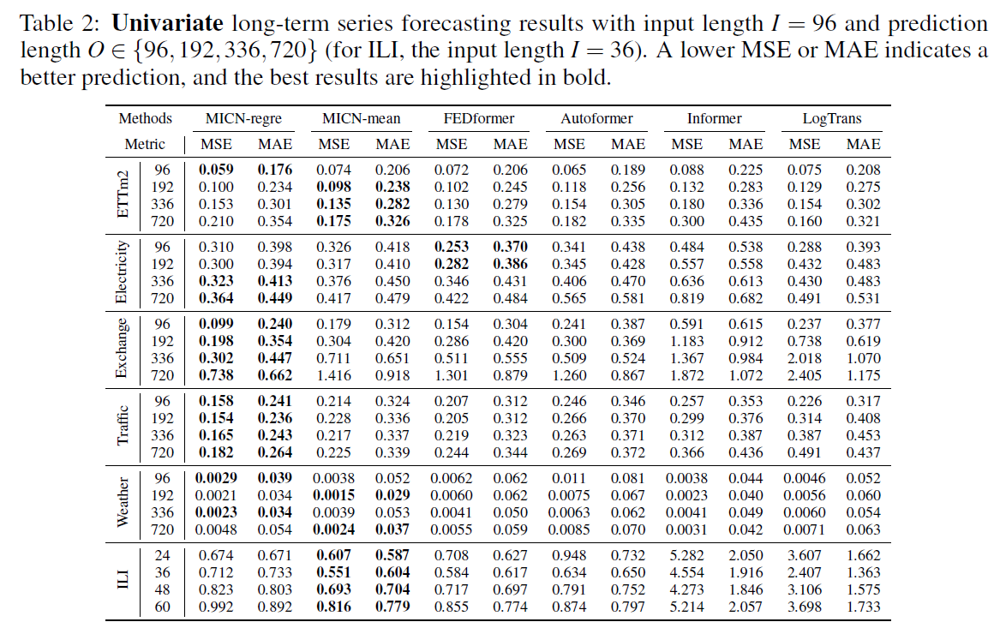
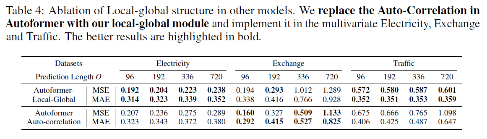
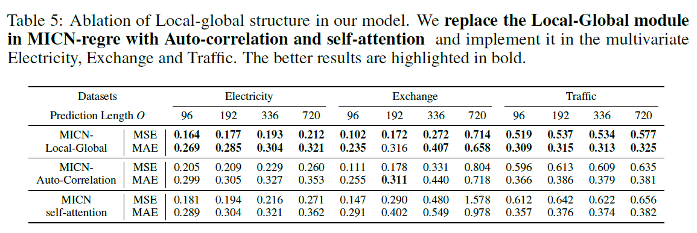
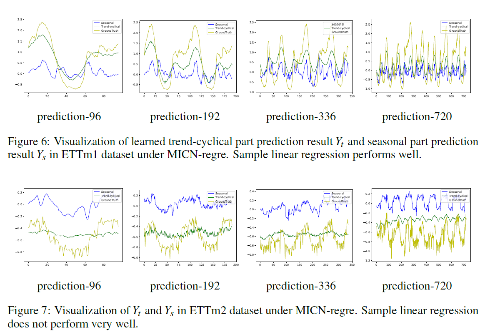

# MICN
Code release of paper ["MICN: Multi-scale Local and Global Context Modeling for Long-term Series Forecasting"](https://openreview.net/pdf?id=zt53IDUR1U) (ICLR 2023 oral)

MICN achieve SOTA on six benchmarks.

##  Overall Architecture
As shown in Figure 1, we decompose the time series into seasonal part and trend part by Multi-scale Hybrid Decomposition. For seasonal part, we use Seasonal Prediction block to predict. For trend part, we use simple regression to predict. 
<p align="center">

<br><br>
</p>


### Seasonal Prediction block
The seasonal part contains several different patterns after Multi-scale Hybrid Decomposition. For each pattern, we use local-global module to extract local information and global correlations. 
<p align="center">

<br><br>
</p>


#### Local-Global module
We use downsampling convolution to extract local features and isometric convolution to capture global correlations. 
<p align="center">

<br><br>
</p>

## Get Started

1. `pip install -r requirements.txt`

2. Data. All the six benchmark datasets can be obtained from [Google Drive](https://drive.google.com/file/d/1CC4ZrUD4EKncndzgy5PSTzOPSqcuyqqj/view?usp=sharing) or [Tsinghua Cloud](https://cloud.tsinghua.edu.cn/f/b8f4a78a39874ac9893e/?dl=1).

3. Reproducibility. We provide the experiment scripts of all benchmarks under the folder `./scripts`. You can reproduce the experiments results by:

```
bash ./scipts/ETTm.sh
bash ./scipts/ETTh.sh
bash ./scipts/ECL.sh
bash ./scipts/Exchange.sh
bash ./scipts/Traffic.sh
bash ./scipts/WTH.sh
bash ./scipts/ILI.sh
```

## Experiments
### Main Results
#### Multivariate results


#### Univariate results


### Model Analysis
#### Local-global vs. self-attetion, Auto-correlation




### Visualization
Visualization of learned trend-cyclical part prediction and seasonal part prediction.




## Contact
If you have any questions, please contact wanghuiqiang@stu.scu.edu.cn. Welcome to discuss together.

## Citation
If you find this repo useful, please cite our paper
```
@article{micn,
  title={MICN: Multi-scale Local and Global Context Modeling for Long-term Series Forecasting},
  author={Huiqiang Wang and Jian Peng and Feihu Huang and Jince Wang and Junhui Chen and Yifei Xiao},
  booktitle={International Conference on Learning Representations},
  year={2023}
}
```


## Acknowledgement

We appreciate the following github repos a lot for their valuable code base or datasets:

https://github.com/thuml/Autoformer

https://github.com/zhouhaoyi/Informer2020

https://github.com/zhouhaoyi/ETDataset

https://github.com/laiguokun/multivariate-time-series-data
